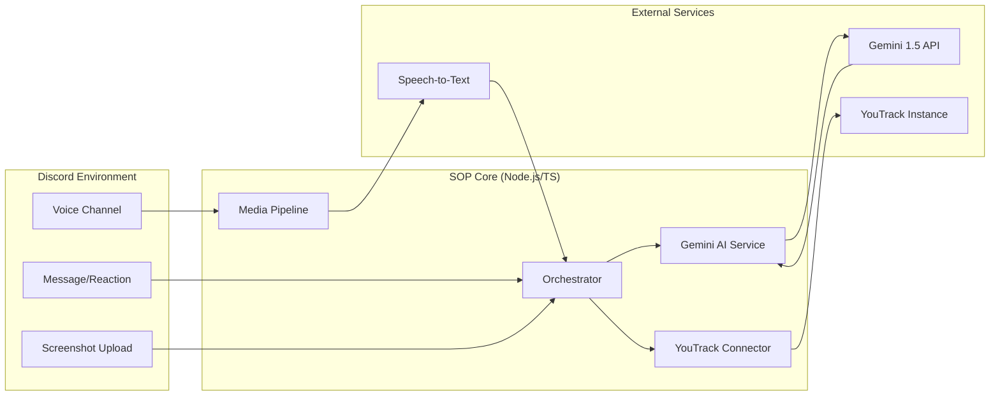

# High-Level Architecture: Sync-o-path (SOP)

Sync-o-path is an AI-driven integration layer designed to bridge communication gaps between Discord and YouTrack, automating the transformation of unstructured conversation into structured project management data.

## Overview

- **Location**: `src/` (Core logic and service integrations)
- **Purpose**: To eliminate administrative overhead in software development by capturing, analyzing, and documenting team interactions in real-time.
- **Pre-requisites**: 
    - Discord Bot Token with Voice and Message permissions.
    - YouTrack Permanent Token with API access.
    - Google Gemini API Key for LLM/Vision processing.
    - Media processing environment (FFmpeg) for audio handling.

## System Components

### 1. Discord Interface Layer
- **Description**: Built using `discord.js`, this layer serves as the system's entry point. It monitors voice channel transitions, message reactions, and file attachments.
- **Responsibilities**: Event listening, message framing, and providing user feedback (e.g., ticket links, status updates).

### 2. Orchestration Engine
- **Description**: The central logic hub that coordinates between the Discord layer, AI services, and the YouTrack API.
- **Responsibilities**: Context gathering, state management for voice sessions, and error handling across service boundaries.

### 3. AI Service (Gemini 1.5 Flash)
- **Description**: Leverages Google’s multimodal LLM for high-speed analysis of text and images.
- **Responsibilities**: 
    - **Text**: Summarization, action item extraction, and tone normalization for tickets.
    - **Vision**: Analyzing UI screenshots to identify defects and suggest technical root causes.

### 4. Media Processing Pipeline
- **Description**: A dedicated pipeline for handling real-time audio streams from Discord voice channels.
- **Responsibilities**: Audio capturing, chunking, and interfacing with Speech-to-Text (STT) services (Whisper or Google Cloud Speech).

### 5. YouTrack Integration Module
- **Description**: A REST API wrapper tailored for YouTrack issue management.
- **Responsibilities**: Mapping Discord entities to YouTrack fields, issue creation, and attachment handling.

## Data Flow Architecture

## Technology Stack

- **Runtime**: Node.js (LTS)
- **Language**: TypeScript (Strict Mode)
- **Framework**: Discord.js
- **AI/ML**: Google Gemini 1.5 Flash (Multimodal)
- **Infrastructure**: Dockerized microservices (planned)
- **Integration**: YouTrack REST API

## Security & Compliance

- **Secret Management**: All API keys and tokens are managed via environment variables and never committed to version control.
- **Data Privacy**: Voice data is processed in-memory and destroyed immediately after transcription. No long-term storage of raw audio is maintained unless explicitly configured.
- **Access Control**: Discord-to-YouTrack mapping ensures that only authorized users can trigger ticket creation.

## Error Handling & Resilience

- **Retry Logic**: Exponential backoff for YouTrack API and Gemini API calls.
- **Fallback Mechanisms**: If Gemini analysis fails, the system defaults to creating a "Raw" ticket containing the original message or transcript for manual review.
- **Graceful Degradation**: If voice recording fails, the system continues to support text-based reaction triggers.
