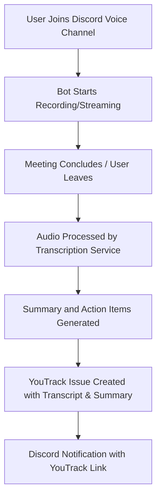
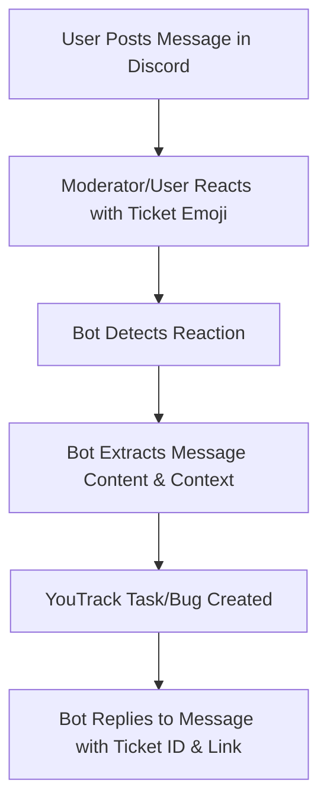
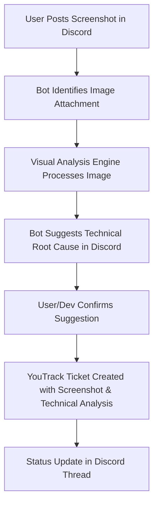
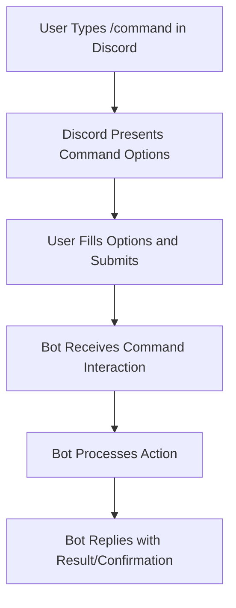

# User Flow Documentation

This document outlines the primary user interaction paths within the Sync-o-path system, focusing on the integration between Discord and YouTrack.

## 1. Meeting Transcription Flow

**Description**: Automates the process of capturing, transcribing, and documenting Discord voice meetings as YouTrack issues.

### Flow Diagram

---

## 2. One-Click Ticketing Flow

**Description**: Enables rapid task or bug creation directly from Discord messages using reactions.

### Flow Diagram

---

## 3. Visual Bug Analysis Flow

**Description**: Streamlines the reporting of visual bugs from screenshots to technical suggestions and formal ticketing.

### Flow Diagram

---

## 4. Slash Commands Flow

**Description**: Provides direct interaction with the bot via Discord slash commands for various project management tasks (e.g., `/create-issue`, `/standup`, `/sprint`).

### Flow Diagram

